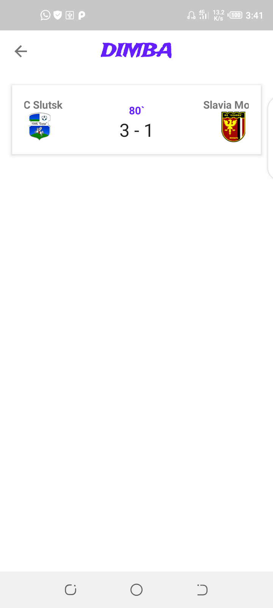

# Dimba -In Progress 🚧
|[](https://www.codacy.com?utm_source=github.com&amp;utm_medium=referral&amp;utm_content=odaridavid/Dimba&amp;utm_campaign=Badge_Grade)|[](https://travis-ci.com/odaridavid/Dimba)|
|:---:|:---:|

A football companion app showcasing cool stuff ⚽🏀
## Prerequisite

To Get Started on the project you will need to link it to a [firebase project](https://firebase.google.com/)  
and copy your google-services.json file to the app directory.

Then obtain an api key from rapid-api to be able to make requests to the
[football api endpoints](https://rapidapi.com/api-sports/api/api-football/endpoints).

To use your api key with this project,you will need to add it to a global  
```gradle.properties``` file so as not to add it to version control and  
expose your key and configure the projects app module build.gradle to  
reflect the name you gave your API Key.

To Access the global ```gradle.properties``` ,Locate the `.gradle` file  
in the following directory

  > Windows: C:\Users\<Your Username>\.gradle

  > Mac: /Users/<Your Username>/.gradle

  > Linux: /home/<Your Username>/.gradle

If it doesn't exist create one and add in your API key like so
```properties
 
 PROJECT_API_KEY = 'API_KEY_VALUE'
 
```

## Libraries Used

- [Android Jetpack](https://developer.android.com/jetpack)🚀
- [Retrofit](https://square.github.io/retrofit/) - type safe http client
and supports coroutines out of the box.
- [Moshi](https://github.com/square/moshi) - JSON Parser,used to parse
requests on the data layer for Entities and understands Kotlin non-nullable
and default parameters
- [okhttp-logging-interceptor](https://github.com/square/okhttp/blob/master/okhttp-logging-interceptor/README.md) - logs HTTP request and response data.
- [kotlinx.coroutines](https://github.com/Kotlin/kotlinx.coroutines) - Library Support for coroutines,provides `runBlocking` coroutine builder used in tests
- [Material Design](https://material.io/develop/android/docs/getting-started/) - build awesome beautiful UIs.🔥🔥
- [Koin](https://github.com/InsertKoinIO/koin) - lightweight dependency injection framework
- [Coil](https://github.com/coil-kt/coil) - Image loading
- [Timber](https://github.com/JakeWharton/timber) - Logger
- [threetenbp](https://github.com/JakeWharton/threetenbp)


## Screenshots

|||
|:--:|:--:|

## Contributions

All Contributions are welcome.Currently there is no style guide on how
this is being done,one will be worked on if necessary.

## License

```
  Copyright 2020 David Odari
 
  Licensed under the Apache License, Version 2.0 (the "License"); you may not use this file except
  in compliance with the License. You may obtain a copy of the License at
           http://www.apache.org/licenses/LICENSE-2.0
  Unless required by applicable law or agreed to in writing, software distributed under the License
  is distributed on an "AS IS" BASIS, WITHOUT WARRANTIES OR CONDITIONS OF ANY KIND, either express
  or implied. See the License for the specific language governing permissions and limitations under
  the License.

 ```